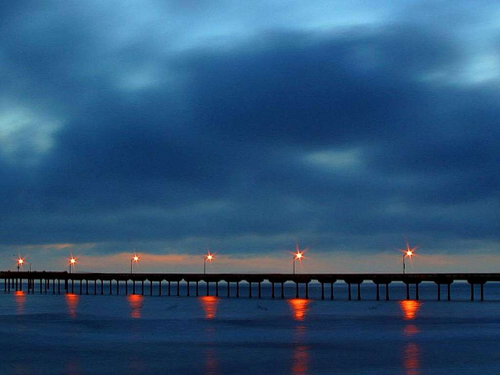

# A Public Domain Picture

**Date:** 2026-02-22

I located a source for the picture I'm using as [Github User Icon](https://github.com/groda).

It's open-source 😃—I mean public domain—and can be found [here](https://boudewijnhuijgens.getarchive.net/amp/media/sunset-at-pacific-beach-aaa0a0).

## Sunset at Pacific Beach

## AI Description

This photograph captures a sunset over the ocean, featuring a long pier extending into the water. 

- **Location:** The scene is identified as Crystal Pier located in Pacific Beach, San Diego. 
- **Atmosphere:** The image depicts a dramatic or moody twilight sky filled with dark, stormy clouds contrasted by the warm lights illuminating the pier. 
- **Reflection:** The orange lights from the pier are reflected onto the surface of the water below. 

## A thought on AI

I wrote this note without using AI except for the section "AI Description" which is copied from the "AI Overview" text appearing in Google Lens. 

I'm not sure I like this ubiquitous presence of AI. Sure, it's nice and makes any insignificant note look more polished and well thought-out. But somehow this AI is always in the way 😅 and it's a strange feeling. Also, please, I wouldn't describe the mood as "dramatic", and furthermore I always thought it was a sunrise. But I won't bother regenerating the text or asking another AI for a better (whatever "better" means) description. I ~~almost~~ have the impression I'm ruining the whole experience of this picture (the AI and I are ruining, I mean). 

